# 🛍️ AuraShop — Enterprise N-Tier E-Commerce Platform

<p align="center">
  
  
  
  
  
  
</p>

<p align="center">
  <strong>A modern, enterprise-grade E-Commerce web application built with ASP.NET Core 10 MVC, strictly adhering to Clean Architecture principles, the Repository Pattern, and Unit of Work design.</strong>
</p>

<p align="center">
  <a href="#-project-overview">Project Overview</a> •
  <a href="#-system-architecture">Architecture</a> •
  <a href="#-key-features">Key Features</a> •
  <a href="#-technology-stack">Tech Stack</a> •
  <a href="#-domain-model--database-design">Database Schema</a> •
  <a href="#-project-structure">Project Structure</a> •
  <a href="#-getting-started">Getting Started</a> •
  <a href="#-configuration">Configuration</a> •
  <a href="#-design-patterns--best-practices">Design Patterns</a>
</p>

---

## 📖 Project Overview

**AuraShop** is a scalable, feature-rich e-commerce web platform designed to provide a frictionless online shopping experience for customers and an intuitive, secure back-office administration suite for store operators.

Built on the latest **.NET 10** runtime and **ASP.NET Core MVC**, the application is engineered with an emphasis on **separation of concerns**, **maintainability**, and **high performance**. It features an asynchronous shopping cart system, dynamic product catalogs with live sorting and pagination, a customer product review and rating engine, automated HTML email dispatching, and a role-based administrative control panel with real-time CRUD operations.

---

## 🏛️ System Architecture

AuraShop follows a strict **N-Tier Layered Architecture** coupled with the **Repository and Unit of Work patterns**, ensuring complete decoupling between presentation, business rules, and data access.

```mermaid
graph TD
    Client["🌐 Client (Browser / Mobile)"]
    
    subgraph PresentationLayer["myshop.Web (Presentation Layer)"]
        Controllers["Controllers (Customer, Product, Category, Review, CheckOut, Home)"]
        RazorViews["Razor Views & ViewModels (.cshtml)"]
        StaticAssets["Static Assets & JS (AJAX, DataTables, SweetAlert2)"]
    end

    subgraph BusinessLogicLayer["myshop.BLL (Business Logic Layer)"]
        Services["Service Implementations (ProductService, CartService, OrderServices, ReviewService, UserService, EmailService, FileService)"]
        ServiceInterfaces["Service Interfaces (IProductService, ICartService, etc.)"]
        DTOs["DTOs (Data Transfer Objects)"]
        AutoMapperProfiles["AutoMapper Profiles (Entity <-> DTO)"]
    end

    subgraph DataAccessLayer["myshop.DAL (Data Access Layer & Domain)"]
        UnitOfWork["Unit of Work (IUnitOfWork)"]
        Repositories["Generic & Specific Repositories (ProductRepo, OrderRepo, ReviewRepo, etc.)"]
        DbContext["ApplicationDbContext (EF Core)"]
        Interceptors["ChangeTracker Interceptors (ISoftDelete, IAuditable)"]
        Entities["Domain Models (Product, Category, OrderHeader, OrderDetail, Review, ApplicationUser)"]
        FluentConfigs["Fluent API Configurations (IEntityTypeConfiguration<T>)"]
    end

    Database[("🗄️ Microsoft SQL Server")]

    Client -->|HTTP / HTTPS| PresentationLayer
    PresentationLayer -->|Invokes Services & DTOs| BusinessLogicLayer
    BusinessLogicLayer -->|Invokes Unit of Work| DataAccessLayer
    DataAccessLayer -->|Queries / Persists| Database
```



### Layer Breakdown

1. **`myshop.Web` (Presentation Layer)**:
   - Contains ASP.NET Core MVC Controllers, Razor Views, and ViewModels.
   - Handles HTTP request lifecycle, routing, model validation, and view rendering.
   - Enforces authentication/authorization attributes (`[Authorize(Roles = "Admin")]`).
   - Houses client-side scripting (AJAX cart updates, DataTables, SweetAlert2 modals, Toastr alerts).

2. **`myshop.BLL` (Business Logic Layer)**:
   - Encapsulates all domain workflows and business rules.
   - Consists of dedicated services (`ProductService`, `CartService`, `OrderServices`, `ReviewService`, `UserService`, `EmailService`, `FileService`).
   - Utilizes **AutoMapper 16** for bidirectional entity-to-DTO transformations to avoid exposing database entities directly to the client.

3. **`myshop.DAL` (Data Access Layer)**:
   - Implements the **Generic Repository Pattern** and specialized repository classes (`ProductRepo`, `OrderHeaderRepo`, `ReviewRepo`, `CategoryRepo`, `UserRepo`).
   - Employs the **Unit of Work Pattern** (`IUnitOfWork`) to orchestrate repository operations inside a single atomic database transaction.
   - Houses Entity Framework Core `ApplicationDbContext`, entity configurations via Fluent API (`IEntityTypeConfiguration<T>`), and database migrations.
   - Features automatic interceptors for **Soft Deletion** (`ISoftDelete`) and **Audit Timestamps** (`IAuditable`).

---

## ✨ Key Features

### 🛍️ Customer Experience (Storefront)
* **Interactive Product Catalog**: Live AJAX-powered product grid with search filtering, multi-column sorting (price, title), and responsive pagination.
* **Product Details & Customer Reviews**: Dedicated product detail view featuring rich image galleries, descriptions, stock/price indicators, customer star ratings (1–5 stars), and customer review threads.
* **Author-Protected Review System**: Customers can submit, update, or remove their own reviews with verified authorization checks preventing unauthorized modifications.
* **Asynchronous Shopping Cart**: Add, increase, decrease, or remove cart items instantaneously via AJAX without full page refreshes.
* **Dynamic Cart Badge**: Real-time cart counter tracking product quantities across sessions.
* **One-Click Checkout & Order Placement**: Streamlined checkout collecting shipping information and generating itemized order receipts.
* **Order History ("My Orders")**: Customers can view past orders, order status, item breakdowns, dates, and total amounts.

### 🛡️ Admin Dashboard & Management Suite
* **Product Inventory Management**: Complete CRUD operations for products with category assignments, pricing, and automated physical file upload/cleanup on edit/delete.
* **Category Management**: Full CRUD lifecycle for product categories.
* **User & Role Administration**: Manage system users, promote/demote between `Admin` and `Customer` roles, inspect profile data, and lock/unlock accounts.
* **DataTables Integration**: High-performance, searchable, sortable, and paginated tables for managing massive datasets effortlessly.

### 📧 Automated Email Notifications (MailKit & MimeKit)
* **Welcome Email**: Responsive HTML email dispatched upon user registration.
* **Order Confirmation Email**: Detailed HTML receipt dispatched upon checkout, featuring shipping address, order ID, dynamic itemized table, and total pricing.

### ⚙️ Core Infrastructure & Resilience
* **Automated Soft Delete**: Entities implementing `ISoftDelete` are flagged (`IsDeleted = true`) rather than physically dropped, preserving historical integrity.
* **Audit Trail**: Entities implementing `IAuditable` automatically capture `CreatedAt` and `UpdatedAt` timestamps upon `SaveChanges()`.
* **ASP.NET Core Identity**: Secure password hashing, cookie-based session management, and role-based policy authorization.

---

## 💻 Technology Stack

| Category | Technology |
|---|---|
| **Runtime & Framework** | [.NET 10.0](https://dotnet.microsoft.com/download/dotnet/10.0) / ASP.NET Core MVC 10.0 |
| **Object-Relational Mapper (ORM)** | [Entity Framework Core 10.0](https://learn.microsoft.com/en-us/ef/core/) (Code-First) |
| **Database** | Microsoft SQL Server / LocalDB / Azure SQL |
| **Authentication & Security** | ASP.NET Core Identity, Claims-based Authorization |
| **Object Mapping** | [AutoMapper 16.2](https://automapper.org/) |
| **Email Service** | [MailKit 4.17](https://github.com/jstedfast/MailKit) & [MimeKit 4.17](https://github.com/jstedfast/MimeKit) (SMTP) |
| **Payment SDK (Integrated)** | [Stripe.net 43.4](https://stripe.com/docs/api) |
| **Frontend Framework & Styling** | Bootstrap 5.3, Custom Glassmorphism Theme, FontAwesome 6 |
| **Client-Side Interactivity** | jQuery 3.6, AJAX, DataTables, SweetAlert2, Toastr |

---

## 🗄️ Domain Model & Database Design

The database schema is structured around normalized entities configured with EF Core Fluent API:

```
┌─────────────────┐       1:N       ┌──────────────────┐
│    Category     ├─────────────────┤     Product      │
│  - Id           │                 │  - Id            │
│  - Name         │                 │  - Name          │
│  - Description  │                 │  - Description   │
│  - IsDeleted    │                 │  - Price         │
│  - CreatedAt    │                 │  - Img           │
│  - UpdatedAt    │                 │  - CategoryId    │
└─────────────────┘                 │  - IsDeleted     │
                                    │  - CreatedAt     │
                                    │  - UpdatedAt     │
                                    └─────────┬────────┘
                                              │
                      ┌───────────────────────┼────────────────────────┐
                      │ 1:N                   │ 1:N                    │ 1:N
             ┌────────▼─────────┐    ┌────────▼─────────┐     ┌────────▼─────────┐
             │      Review      │    │   OrderDetail    │     │   ShoppingCart   │
             │  - Id            │    │  - Id            │     │  - Id            │
             │  - Rating (1-5)  │    │  - OrderHeaderId │     │  - ProductId     │
             │  - Comment       │    │  - ProductId     │     │  - Application...│
             │  - ProductId     │    │  - Count         │     │  - Count         │
             │  - Application...│    │  - Price         │     └──────────────────┘
             │  - IsDeleted     │    └────────▲─────────┘
             │  - CreatedAt     │             │
             └────────┬─────────┘             │ N:1
                      │ N:1                   │
             ┌────────▼───────────────────────┴─────────┐
             │             OrderHeader                  │
             │  - Id                                    │
             │  - ApplicationUserId                     │
             │  - OrderDate                             │
             │  - TotalPrice                            │
             │  - Name, PhoneNumber, Address, City      │
             └──────────────────▲───────────────────────┘
                                │ N:1
                     ┌──────────┴──────────┐
                     │   ApplicationUser   │
                     │  (IdentityUser)     │
                     │  - Name             │
                     │  - Address, City    │
                     └─────────────────────┘
```

---

## 📂 Project Structure

```text
Shop_Proj/
├── myshop.sln                                # Visual Studio Solution
├── Directory.Build.props                     # Solution-wide build configurations
├── Directory.Build.targets                   # Solution-wide target definitions
│
├── myshop.Web/                               # Presentation Layer (MVC)
│   ├── Controllers/                          # MVC Controllers (Customer, Product, Category, etc.)
│   ├── ViewModels/                           # Presentation-specific ViewModels
│   ├── Views/                                # Razor Views (.cshtml) & HTML Email Templates
│   │   ├── Category/                         # Category CRUD Views
│   │   ├── CheckOut/                         # Checkout & Order Placement Views
│   │   ├── Customer/                         # Catalog, Product Details, Orders Views
│   │   ├── Home/                             # Authentication, User & Role Management Views
│   │   ├── Product/                          # Product CRUD Views
│   │   ├── Shared/                           # Layouts, Partials, Navigation, Notifications
│   │   ├── OrderConfirmationEmail.html       # HTML Template for Order Confirmation
│   │   └── WelcomeEmail.html                 # HTML Template for User Welcome
│   ├── wwwroot/                              # Static Web Assets (CSS, JS, Images, Libs)
│   ├── appsettings.json                      # Application Configuration
│   ├── appsettings.Development.json          # Dev Connection Strings & SMTP Settings
│   └── Program.cs                            # DI Registrations & Middleware Pipeline
│
├── myshop.BLL/                               # Business Logic Layer
│   ├── DTOs/                                 # Data Transfer Objects
│   │   ├── Cart/                             # CartItem DTO
│   │   ├── Category/                         # Category DTOs
│   │   ├── Email/                            # SMTP & Email Settings DTOs
│   │   ├── Order/                            # Order, OrderItem, Checkout DTOs
│   │   ├── Product/                          # Product Admin & Customer DTOs
│   │   ├── ReviewDTO/                        # Review Creation, Edit & Display DTOs
│   │   └── User/                             # User Auth, Roles & Profile DTOs
│   ├── IServices/                            # Business Service Interfaces
│   ├── Services/                             # Business Service Implementations
│   │   ├── CartService.cs                    # Session-based Cart Management
│   │   ├── CategoryService.cs                # Category Operations
│   │   ├── EmailService.cs                   # MailKit SMTP Dispatcher
│   │   ├── FileService.cs                    # Physical File & Image Upload/Deletion
│   │   ├── OrderServices.cs                  # Order Placement & History Processing
│   │   ├── ProductService.cs                 # Product Management & Filtering
│   │   ├── ReviewService.cs                  # Reviews & Rating Management
│   │   └── UserServices.cs                   # Identity User & Role Operations
│   └── Mapping/                              # AutoMapper Profiles (Entity <-> DTO)
│
└── myshop.DAL/                               # Data Access Layer & Domain Models
    ├── Configurations/                       # Entity Configurations (Fluent API)
    ├── Data/                                 # DbContext & Unit of Work Implementation
    │   ├── ApplicationDbContext.cs           # EF Core Context with Soft Delete & Auditing
    │   └── UnitOfWork.cs                     # Unit of Work Transaction Coordinator
    ├── IRepository/                          # Repository Interfaces (Generic & Specific)
    ├── Repository/                           # Repository Implementations
    ├── Iconfiguration/                       # IUnitOfWork Contract
    ├── Models/                               # Domain Entities & Interfaces (ISoftDelete, IAuditable)
    └── Migrations/                           # Entity Framework Core Code-First Migrations
```

---

## 🚀 Getting Started

### Prerequisites

Ensure you have the following installed on your development workstation:
* [.NET 10.0 SDK](https://dotnet.microsoft.com/download/dotnet/10.0)
* [SQL Server 2019/2022](https://www.microsoft.com/en-us/sql-server/sql-server-downloads) or SQL Server Express / LocalDB
* [Visual Studio 2022 (v17.12+)](https://visualstudio.microsoft.com/) / [Visual Studio Code](https://code.visualstudio.com/) / [JetBrains Rider](https://www.jetbrains.com/rider/)

---

### Step-by-Step Installation

#### 1. Clone the Repository
```bash
git clone https://github.com/mohamedty69/ShopHub-Startup-Template.git
cd ShopHub-Startup-Template
```

#### 2. Configure Connection String & SMTP Settings
Open `myshop.Web/appsettings.Development.json` (or `appsettings.json`) and configure your database connection and SMTP credentials:

```json
{
  "ConnectionStrings": {
    "DefaultConnection": "Server=YOUR_SERVER_NAME;Database=AuraShopDB;Trusted_Connection=True;MultipleActiveResultSets=true;TrustServerCertificate=True;"
  },
  "StmpConfig": {
    "Server": "smtp.gmail.com",
    "Port": 587,
    "SenderEmail": "your-email@gmail.com",
    "Password": "your-app-password"
  }
}
```

#### 3. Apply Database Migrations
Run the EF Core migration command from your terminal:

**Using .NET CLI:**
```bash
dotnet ef database update --project myshop.DAL --startup-project myshop.Web
```

**Using Visual Studio Package Manager Console:**
```powershell
Update-Database -Project myshop.DAL -StartupProject myshop.Web
```

> [!NOTE]
> On initial startup, the application will automatically execute `db.Database.Migrate()` and seed the default Identity roles (`Admin`, `Customer`).

#### 4. Run the Application
```bash
dotnet run --project myshop.Web
```

Navigate to `https://localhost:7020` (or the port specified in your console) to explore the application.

---

## 🛡️ Default Roles & Security

| Role | Access Scope | Capabilities |
|---|---|---|
| **`Admin`** | Administrative Back-Office (`/Product`, `/Category`, `/Home/DisplayUsers`, etc.) | Full CRUD on Products & Categories, User Role assignment, Account Lockout control |
| **`Customer`** | Storefront (`/Customer`, `/CheckOut`, `/Review`) | Browse catalog, add to cart, checkout, view order history, submit and edit reviews |

---

## 💡 Design Patterns & Best Practices

* **N-Tier Layering**: Clean decoupling between Presentation (UI/Controllers), Business Logic (Services/DTOs), and Data Access (Repositories/DbContext).
* **Repository & Unit of Work**: Encapsulates data access and ensures multiple repository mutations execute atomically within a single transaction.
* **DTO Pattern & AutoMapper**: Strictly prevents domain entities from leaking into views or API responses, isolating changes and reducing payload size.
* **Aspect-Oriented Interceptors**: Entity lifecycle events (soft-delete, creation/modification timestamps) are handled transparently inside `ApplicationDbContext.SaveChanges()`.
* **Dependency Injection**: Loose coupling via built-in ASP.NET Core DI container with standard service lifetimes (`AddScoped`, `AddTransient`).

---

## 🤝 Contributing

Contributions, issues, and feature requests are welcome!
Feel free to check the [issues page](https://github.com/mohamedty69/ShopHub-Startup-Template/issues) to participate.

1. Fork the project
2. Create your feature branch (`git checkout -b feature/AmazingFeature`)
3. Commit your changes (`git commit -m 'Add some AmazingFeature'`)
4. Push to the branch (`git push origin feature/AmazingFeature`)
5. Open a Pull Request

---

## 📄 License

This project is licensed under the MIT License — see the [LICENSE](LICENSE) file for details.
